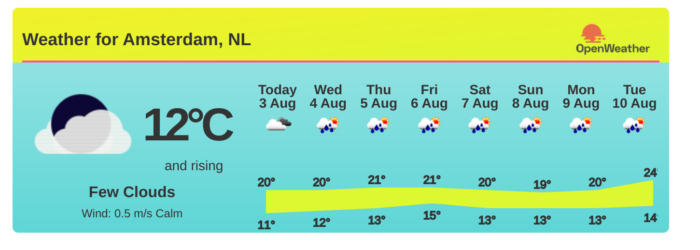

<!-- <pre>
🌞🌞                  🏊             🌴 🏝️🏝️🏝️🏝️ 
🌞🌞                                🌴🏝️🏝️🏝️🏝️🏝️  
           🏊              🏊       🌴🏝️🏝️🏝️🏝️🏝️
	                          🌴🏝️🏝️🏝️🏝️🏝️🏝️

🏊             🏊       🏝️ 
&nbsp;&nbsp;&nbsp;🏊&nbsp;🏊&nbsp;&nbsp;&nbsp;&nbsp;🏝️&nbsp;
&nbsp;🏊&nbsp;&nbsp;&nbsp;&nbsp;🏊&nbsp;&nbsp;&nbsp;&nbsp;🏝️&nbsp;
&nbsp;&nbsp;&nbsp;👕🏊&nbsp;&nbsp;&nbsp;🌴🏝️&nbsp;
</pre> -->

	
# Your summer-ready GitHub profile 

Follow this 6-step plan and get ready for the Summer together with your friends at GitHub!
	
- Step 1: Customize your GitHub profile picture with GitHub Actions to show you're ready 🌞
- Step 2: Decide what clothes to wear? 🥵
- Step 3: Play some summer tunes 🎷
- Step 4: Participate in GitHub's Summer games 🏄‍♀️
- Step 5: Join ✨ GitHub's exclusive Summer Club ✨
- Step 6: Spread the word and be creative with your summer-ready GitHub profile 📣
	

_Ready? Let's go!_

---

### Step 1: <a href="https://github.com/SvanBoxel/secret-profile/issues/new/choose"> Customize your GitHub profile picture with GitHub Actions to show you're ready! 🌞 </a> 

---

<table>
<tr>
<td>

### Step 2: Decide what clothes to wear 🥵
	

				
</td>
<td>
	
### Step 3: Play some summer tunes 🎷

			
</td>
</tr>
</table>

---

### Step 4: Participate in GitHub's Summer games
	🌞 Todo

---

### Step 5: Join ✨ GitHub's exclusive Summer Club ✨ 

---

### Step 6: Spread the word and be creative with your summer-ready GitHub profile 📣

Fork it! 

